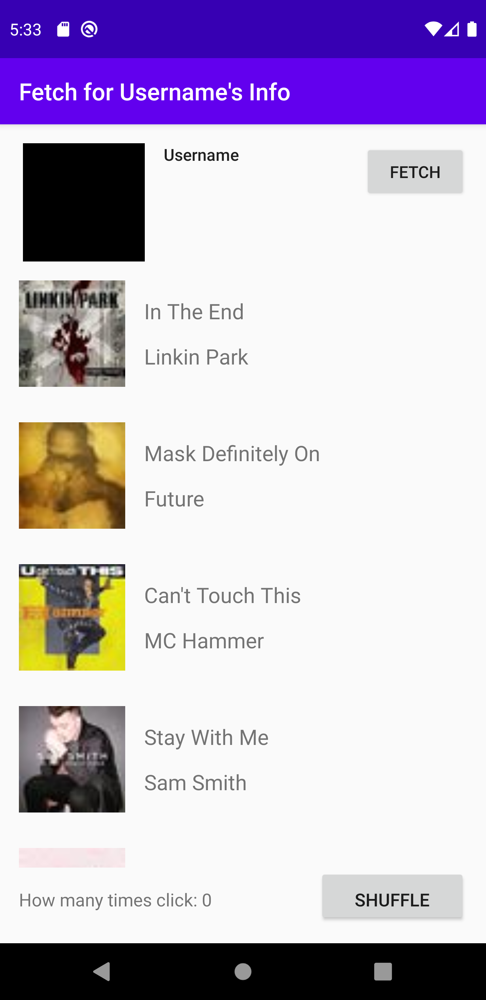

# HttpJsonParser
## Xuweiyi Chen

#### Description

- This app serves as a HttpJsonParser. When user press Fetch, it will fetch for the username and user's avatar.

- Inside of the application, it records how many times users clicks on the RecycleView, hold the song manager which contains a list of songs, and hold a api manager which hold the information of the user

- It contains a Fetch method, and handles the error message by Toasting

- The image of user's avatar is shown by the Picasso

#### Possible Error

- There is possible error. If you can clean and rebuild the project, everything will be good.

#### Explanation

- It has some features like Dotify, but I did them again in case I forget how to do the previous part. Every requirement is matched otherwise. 

#### Screenshot of the app running on an emulator

